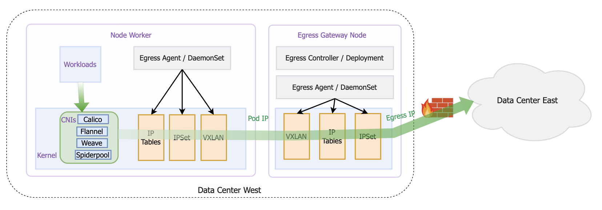

# egressgateway

English | [简体中文](docs/README.zh.md)

## About

EgressGateway is a egress policy solution designed for Kubernetes clusters, with a primary focus on managing the egress traffic of Pods to external networks. It addresses challenges related to inter-cluster communication, egress policy control, and high availability. Additionally, it offers support for various network solutions and custom resource definitions (CRDs), enabling users to configure and manage egress policies with flexibility.

## Architecture

## Why EgressGateway

### Support a range of features and advantages

* Solve IPv4 IPv6 dual-stack connectivity,ensuring seamless communication across different protocol stacks.
* Solve the high availability of Egress Nodes, ensuring network connectivity remains unaffected by single-point failures.
* Support finer-grained policy control, allowing flexible filtering of Pods' Egress policies, including Destination CIDR.
* Support application-level control, allowing EgressGateway to filter Egress applications (Pods) for precise management of specific application outbound traffic.
* Support multiple egress gateways instance,capable of handling communication between multiple network partitions or clusters.
* Support namespaced egress IP.
* Supports automatic detection of cluster traffic for egress gateways policies.
* Support namespace default egress instances.
* Can be used in low kernel version, making EgressGateway suitable for various Kubernetes deployment environments.
  
### Compatible with the following network solutions

* [Calico](https://github.com/projectcalico/calico)
* [Flannel](https://github.com/flannel-io/flannel)
* [Weave](https://github.com/weaveworks/weave)
* [Spiderpool](https://github.com/spidernet-io/spiderpool)

## Getting started using EgressGateway

Please refer to the [installation guide](docs/usage/Install.en.md).

## Join the EgressGateway Community

We welcome contributions in any kind. If you have any questions about contributions, please consult the [contribution documentation](docs/develop/Contribute.en.md).

## License

EgressGateway is licensed under the Apache License, Version 2.0. See [LICENSE](https://github.com/spidernet-io/spiderpool/blob/main/LICENSE) for the full license text.
