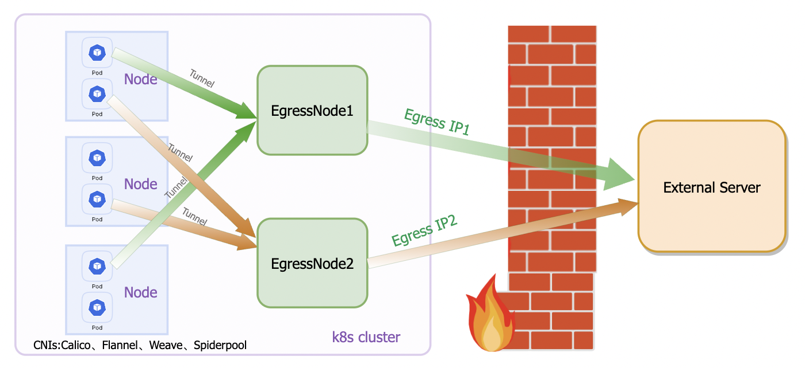

# egressgateway

## About

In a Kubernetes (k8s) cluster, when Pods access external services, their Egress IP addresses are not fixed. In the Overlay network, the Egress IP address is determined by the node where the Pod resides. While in the Underlay network, Pods directly use their own IP addresses for external communication. Consequently, when Pods are rescheduled, regardless of the network mode, their IP addresses for external communication change. This instability poses a challenge for system administrators in managing IP addresses, especially as the cluster scales and during network fault diagnostics. Controlling egress traffic based on a Pod's original egress IP outside the cluster becomes difficult.

To solve this problem, EgressGateway has been introduced into the k8s cluster. It is an open-source EgressGateway designed to resolve egress egress IP address issues across various CNI network modes, such as Calico, Flannel, Weave, and Spiderpool. Through flexible configuration and management of egress policies, EgressGateway allows setting egress IP addresses for tenant-level or cluster-level workloads. When Pods need to access the external network, the system consistently uses the configured Egress IP as the egress address, providing a stable solution for egress traffic management.

## Architecture

## Why EgressGateway

### Support a range of features and advantages

* Solve IPv4 IPv6 dual-stack connectivity,ensuring seamless communication across different protocol stacks.
* Solve the high availability of Egress Nodes, ensuring network connectivity remains unaffected by single-point failures.
* Support finer-grained policy control, allowing flexible filtering of Pods' Egress policies, including Destination CIDR.
* Support application-level control, allowing EgressGateway to filter Egress applications (Pods) for precise management of specific application outbound traffic.
* Support multiple egress gateways instance,capable of handling communication between multiple network partitions or clusters.
* Support namespaced egress IP.
* Support automatic detection of cluster traffic for egress gateways policies.
* Support namespace default egress instances.
* Can be used in low kernel version, making EgressGateway suitable for various Kubernetes deployment environments.

### Compatible with the following network solutions

* [Calico](https://github.com/projectcalico/calico)
* [Flannel](https://github.com/flannel-io/flannel)
* [Weave](https://github.com/weaveworks/weave)
* [Spiderpool](https://github.com/spidernet-io/spiderpool)

## Getting started using EgressGateway

Please refer to the [installation guide](docs/usage/Install.en.md).

## Join the EgressGateway Community

We welcome contributions in any kind. If you have any questions about contributions, please consult the [contribution documentation](develop/Contribute.en.md).

## License

EgressGateway is licensed under the Apache License, Version 2.0. See [LICENSE](https://github.com/spidernet-io/spiderpool/blob/main/LICENSE) for the full license text.
