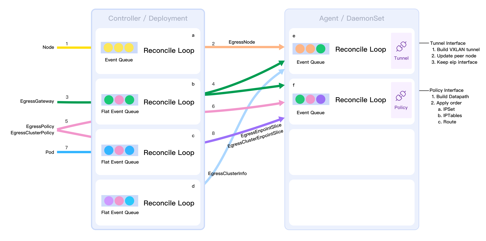

The gateway provides network egress capabilities for Kubernetes clusters.

</img>

Starting with 2021, we received some feedback as follows.

There are two clusters A and B. Cluster A is VMWare-based and runs mainly Database workloads, and Cluster B is a Kubernetes cluster. Some applications in Cluster B need to access the database in Cluster A, and the network administrator wants the cluster Pods to be managed through an egress gateway.

## Features

* Solve IPv4 IPv6 dual-stack connectivity.
* Solve the high availability of Egress Nodes.
* Allow filtering Pods Egress Policy (_Destination CIDR_).
* Allow filtering of egress Applications (_Pods_).
* Can be used in low kernel version.
* Support multiple egress gateways instance.
* Support namespaced egress IP.
* Support automatic detection of cluster traffic for egress gateways policies.
* Support namespace default egress instances.

### Compatibility

* Calico
* Flannel
* Weave
* Spiderpool

### CRDs

* EgressTunnel
* EgressGateway
* EgressPolicy
* EgressClusterPolicy
* EgressEndpointSlice
* EgressClusterEndpointSlice
* EgressClusterInfo

You can follow the [Get Started](https://spidernet-io.github.io/egressgateway/en/usage/Install) to set up your own playground!

## Develop

</img>

Refer to [develop](develop/Develop.md).

## License

EgressGateway is licensed under the Apache License, Version 2.0. See [LICENSE](https://github.com/spidernet-io/spiderpool/blob/main/LICENSE) for the full license text.
