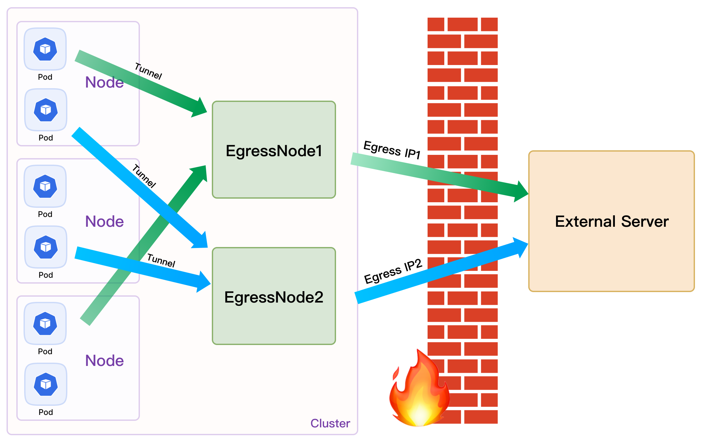

# EgressGateway

在 Kubernetes（k8s）集群中，Pod 访问外部服务时，其出口 IP 地址不是固定的。在 Overlay 网络中，出口 IP 地址为 Pod 所在节点的地址，而在 Underlay 网络中，Pod 直接使用自身的 IP 地址与外部通信。因此，当 Pod 发生新的调度时，无论哪种网络模式，Pod 与外部通信时的 IP 地址都会发生变化。这种不稳定性给系统维护人员带来了 IP 地址管理的挑战。特别是在集群规模扩大以及需要进行网络故障诊断时，在集群外部，基于 Pod 原本的出口 IP 来管控出口流量很难实现。
为解决这个问题，EgressGateway 被引入到 k8s 集群中，它是一个开源的 Egress 网关，旨在解决在不同CNI网络模式下（Calico、Flannel、Weave、Spiderpool）出口 Egress IP 地址的问题。通过灵活配置和管理出口策略，为租户级或集群级工作负载设置 Egress IP，使得 Pod 访问外部网络时，系统会统一使用这个设置的 Egress IP 作为出口地址，从而提供了稳定的出口流量管理解决方案。

## 架构

## 为什么选择 EgressGateway

### 提供了一系列功能和优势

* 解决 IPv4/IPv6 双栈连接问题，确保网络通信在不同协议栈下的无缝连接。
* 解决 Egress 节点的高可用性问题，确保网络连通性不受单点故障的干扰。
* 允许更精细的策略控制，可以通过 EgressGateway 灵活地过滤 Pods 的 Egress 策略，包括 Destination CIDR。
* 允许过滤 Egress 应用（Pod），能够更精确地管理特定应用的出口流量。
* 支持多个出口网关实例，能够处理多个网络分区或集群之间的通信。
* 支持租户级别的 Egress IP。
* 支持自动检测集群流量的 Egress 网关策略。
* 支持命名空间默认 Egress 实例。
* 可用于较低内核版本，适用于各种 Kubernetes 部署环境。

### 兼容以下网络解决方案

* [Calico](https://github.com/projectcalico/calico)
* [Flannel](https://github.com/flannel-io/flannel)
* [Weave](https://github.com/weaveworks/weave)
* [Spiderpool](https://github.com/spidernet-io/spiderpool)
* [Cilium](https://cilium.io/) 路由模式

## 开始使用 EgressGateway

参考[安装指南](usage/Install)

## 社区

我们欢迎任何形式的贡献。如果您有任何有关贡献方面的疑问，请参阅[贡献指南](develop/Contribute.en.md)。

## License

EgressGateway 基于 Apache License，Version 2.0。详细参考 [LICENSE](https://github.com/spidernet-io/spiderpool/blob/main/LICENSE) 查看完整 LICENSE 内容。
