## VXLAN Speed

EgressGateway uses the vxlan tunnel, and testing shows that vxlan loss is around 10%. If you find that the speed of EgressGateway does not meet the standard, you can follow these steps to check:

1. Confirm that the speed of the host-to-node matches the expected speed;
    1. The offload setting of the network card used by vxlan on the host will have a small impact on the speed of the vxlan interface (there will only be a difference of 0.5 Gbits/sec in the 10G network card test), you can run `ethtool --offload host-interface-name rx on tx on` to turn on offload;
2. The offload setting of the vxlan network card can significantly impact the speed of the vxlan interface. In 10G network card tests, the speed is 2.5 Gbits/sec without offload enabled, and 8.9 Gbits/sec with offload enabled. You can run `ethtool -k egress.vxlan` to check whether checksum offload is turned off, and you can enable offload by setting the `feature.vxlan.disableChecksumOffload` configuration in helm values to `false`.

### Benchmark

#### Bare metal server

The following are the data from our stress tests using bare metal servers.

| Name        | CPU                                       | MEM  | Interface    |
|:------------|:------------------------------------------|:-----|:-------------|
| Node 1      | Intel(R) Xeon(R) CPU E5-2680 v4 @ 2.40GHz | 128G | 10G Mellanox |
| Node 2      | Intel(R) Xeon(R) CPU E5-2680 v4 @ 2.40GHz | 128G | 10G Mellanox |
| Node Target | Intel(R) Xeon(R) CPU E5-2680 v4 @ 2.40GHz | 128G | 10G Mellanox |

| Case  | Item                         | Detail                                            |
|:------|:-----------------------------|:--------------------------------------------------|
| case1 | node -> node                 | `9.44 Gbits/sec sender - 9.41 Gbits/sec receiver` |
| case2 | egress vxlan -> egress vxlan | `9.11 Gbits/sec sender - 9.09 Gbits/sec receiver` |
| case3 | pod -> egress node -> target | `9.01 Gbits/sec sender - 8.98 Gbits/sec receiver` |

#### Virtual machine

The following is a virtual machine using VMWare, which limits the data measured with Node specification of 4C8G.

| Name        | CPU                                         | MEM | Interface |
|:------------|:--------------------------------------------|:----|:----------|
| Node 1      | Intel(R) Xeon(R) Gold 5118 CPU @ 2.30GHz 4C | 8G  | VMXNET3   |
| Node 2      | Intel(R) Xeon(R) Gold 5118 CPU @ 2.30GHz 4C | 8G  | VMXNET3   |
| Node Target | Intel(R) Xeon(R) Gold 5118 CPU @ 2.30GHz 4C | 8G  | VMXNET3   |

| Case  | Item                         | Detail                                            |
|:------|:-----------------------------|:--------------------------------------------------|
| case1 | node -> node                 | `2.99 Gbits/sec sender - 2.99 Gbits/sec receiver` |
| case2 | egress vxlan -> egress vxlan | `1.73 Gbits/sec sender - 1.71 Gbits/sec receiver` |
| case3 | pod -> egress node -> target | `1.23 Gbits/sec sender - 1.22 Gbits/sec receiver` |

