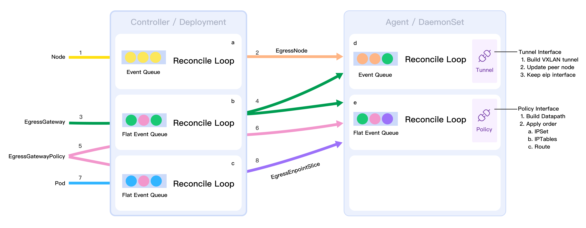

# Egress IP

## 概要

更新 EgressGateway CRD 字段以支持设置 EIP 范围，调整 EgressGatewayEgressPolicy 为租户级，可以选择引用的 EgressGateway，EgressGateway CRD 增加字段限制被引用的租户。以上调整可以允许不同的 EgressGatewayPolicy 分配到不同的 EIP，可以根据不同需求灵活规划服务灵活规划集群出口网络，租户级的资源可以让不同的角色进行出口策略管理。增加 EgressEndpointSlice CRD 聚合集群策略匹配中的工作负载，提升 EgressGateway 的扩展性与性能。

## 动机

当前已经发布 EgressGateway v0.1.0 支持使用 Egress Gateway 的节点 IP 作为出口 IP，它满足了将需要出集群的服务的流量聚合能力。一个集群中通常存在数十组甚至数百组不通的服务，其中多组应用需要访问不同外部网络，单个 EIP 在特定的限制或规则下显得捉襟见肘，比如不同 EIP 的具有不通的防火墙策略，不同EIP 具有不同的访问带宽。通过 EgressGatewayPolicy 为不同的应用或服务分配不同的 EIP 也可以，可以细粒度管理，能避免潜在的安全问题。

## 目标

* 支持设置 Egress IP 范围
* 支持设置租户级 EgressGatewayPolicy
* 提升 EgressGateway 的性能和可扩展性
* 更改涉及的配置参数更新

## 非目标

* 提升数据面转发性能
* 更新项目文档结构

## 设计

### CRD

#### EgressTunnel

用于记录跨节点通信的隧道网卡信息。集群级资源，与 Kubernetes Node 资源名称一一对应。

```yaml
apiVersion: egressgateway.spidernet.io/v1beta1
kind: EgressTunnel
metadata:
   name: "node1"
status:
   tunnel:
      ipv4: "192.200.222.157"  # 1
      ipv6: "fd01::f2"         # 2        
      mac: "66:50:85:cb:b2:bf" # 3
      parent:
         name: "ens160"        # 4
         ipv4: "10.6.1.21/16"  # 5
         ipv6: "fd00::21/112"  # 6
   phase: "Ready"              # 7
   mark: "0x26000000"          # 8
```

1. 隧道 IPv4 地址
2. 隧道 IPv6 地址
3. 隧道 MAC 地址
4. 隧道父网卡
5. 隧道父网卡 IPv4 地址 
6. 隧道父网卡 IPv6 地址 
7. 当前隧道就绪阶段
8. mark 地址，此为新增此段，创建时生成。每个节点对应一个，全局唯一的标签。标签由前缀 + 唯一标识符生成。标签格式如下 `NODE_MARK = 0x26 + value + 0000`，`value` 为 16 位，支持的节点总数为 `2^16`。在下发 policy 规则时所打的标签，取决于该规则的 EIP 所生效的节点。

#### EgressGateway

用于选择一组节点作为 Egress 网关节点，Egress IP 可以在该范围浮动。集群级资源。

```yaml
apiVersion: egressgateway.spidernet.io/v1beta1
kind: EgressGateway
metadata:
  name: "eg1"
spec:                            # 1
  ranges:
   policy: "Random"              # 2
   ipv4:
   - ""
   ipv6:
   - ""
  nodeSelector:                  # 3
    selector: 
      matchLabels:
        egress: "true"
    policy: "AverageSelecton"    # 4
status:
  nodeList:                 # 5
  - name: node1             # 6
    eips:                   
    - ipv4: ""              # 7
      ipv6: ""
      policies:             # 8
      - ""
```

1. 设置 Egress IP 的范围；
   * 支持设置单个 IP `10.6.0.1` ，和段 `10.6.0.1-10.6.0.10 ` ， CIDR `10.6.0.1/26`  的方式 3 种方式；
   * 如果开启双栈要求，IPv4 的数量和 IPv6 的数量时一致的。由于此原因，会导致上面 CIDR 可能并不实用，因此优先级优先实现前 2 种；
2. EIP 的分配策略，暂时只支持 `Random` 随机分配
3. 设置 EgressGateway IP 可浮动的节点范围及策略；
4. policy 选网关节点的策略，暂时只支持 `AverageSelecton` 平均分配
5. Egress Gateway Controller 用于记录显示 nodeSelector 匹配中的节点，对于 Node 更新 Label 或 nodeSelector 变动都会引起此字段变动，Agent 是此字段的消费者，会将属于自己节点的 IP 设置到默认名为 `egress.eip` 网卡；
6. 被引用该 EgressGateway 的 EgressGatewayPolicy 选中，作为网关的节点；
7. 生效的 EIP，如果 EgressGatewayPolicy 中 useNodeIP 为 `true` 时，则该字段为空;
8. Agent 通过该字段判断哪些节点是哪些 EgressGatewayPolicy 的网关节点及非网关节点；

#### EgressGatewayPolicy

用于指定哪些 Pod 走 Egress 策略，以及 Egress 所使用的 IP 地址。租户级资源。

```yaml
apiVersion: egressgateway.spidernet.io/v1beta1
kind: EgressGatewayPolicy
metadata:
  namespace: "default"
  name: "policy-test"
spec:
  egressGatewayName: "eg1"  # 1
  egressIP:                 # 2
    ipv4: ""                            
    ipv6: ""
    useNodeIP: false        # 3
  appliedTo:                # 4
    podSelector:            # 4-a 
      matchLabels:    
        app: "shopping"
    podSubnet:              # 4-b
    - "172.29.16.0/24"
    - 'fd00:1/126'
  destSubnet:               # 5
    - "10.6.1.92/32"
    - "fd00::92/128"
```

1. 选择策略引用的 EgressGateway；
2. Egress IP 准入策略；
   * 若在创建时定义了 `ipv4` 或 `ipv6` 地址，则从 EgressGateway 的 `.ranges` 中分配一个 IP 地址，若用户在 policy1 中，申请使用了 IP 地址 `10.6.1.21` 和 `fd00:1` ，然后创建 policy2 中，申请使用了 IP 地址 `10.6.1.21` 和 `fd00:2` ，则会报错，此时 policy2 会分配失败；
   * 若未定义 `ipv4` 或 `ipv6` 地址，且 `useNodeIP` 为 true 时，则使用所引用 EgressGateway 的匹配中的 Node 的 IP 作为 Egress 地址。
   * 若未在创建时定义 `ipv4` 或 `ipv6` 地址，且 `useNodeIP` 为 `false` 时。
     * 则自动从 EgressGateway 的 `.ranges` 中分配一个 IP 地址（开启 IPv6 时，请求分配一个 IPv4 和 一个 IPv6 地址）；
   * 若 `egressGatewayName` 未定义；
     * 继续则查看是当前 Namespace 的 label 键 `egressgateway.spidernet.io/default` 是否设置默认的 EgressGateway，如果有且允许此租户使用，则从此分配 EgressIP；
     * 继续查看是否有名称为 `default` 全局默认 EgressGateway，如果有且允许此租户使用，则从此分配 EgressIP。
3. 支持使用节点 IP 作为 Egress IP（只允许选择一种）；
4. 选择需要应用 Egress Gateway Policy 的 Pod；
   a. 以 Label 的方式进行选择
   b. 直接指定 Pod 的网段 （a 和 b 不能同时使用）
5. 指定访问 Egress 的目标地址，若未指定目标地址，则生效的策略位目标地址非集群内 CIDR 时，全部转发到 Egress 节点。

#### EgressEndpointSlice

聚合 EgressGatewayPolicy 匹配中的端点，以提高扩展性，仅支持 EgressGatewayPolicy 使用 `podSelector` 的方式匹配 Pod 的情况。每个 EgressEndpointSlice 中的 Endpoint 个数默认不超过 100，最大值可以进行设置。是 EgressGatewayPolicy 的附属资源。

```yaml
apiVersion: egressgateway.spidernet.io/v1beta1
kind: EgressEndpointSlice
metadata:
  name: "policy-test-dx66t"     # 1
  namespace: "default"         
  labels:
    egressgateway.spidernet.io/egressgatewaypolicy: "policy-test"  # 2
  ownerReferences:   # 3
  - apiVersion: egressgateway.spidernet.io/v1beta1
    blockOwnerDeletion: true
    controller: true
    kind: EgressGatewayPolicy
    name: "policy-test"
    uid: 1b2ec0a8-b929-4528-8f99-499f981d319e
data:
  endpoints:                   # 4
  - podName: "web-app"         
    ipv4List:
    - "172.29.30.123" 
    ipv6List:
    - "xxx"         
    nodeName: "node1"          # 5
    uuid: ""
```

1. 名称由 `policy-name-xxxxx` 组成，后面 5 位随机生成；
2. 所属的 EgressGatewayPolicy 名称；
3. 创建时同步设置 ownerReferences；
4. 匹配中的 endpoints 的列表；
5. Pod 所在的节点。

### 数据面规则

对需要生效的规则分为三类：所有节点，相对于 EgressGatewayPolicy 的「网关节点」和「非网关节点」。

#### 所有节点

1. 各节点之间，隧道需要打通的规则就就不一一展开；
2. 将 policy 命中的流量，重新打标签。节点第一次变成网关节点时更新，或者节点 join 时做一次，后面不更新；
   ```shell
   iptables -t mangle -N EGRESSGATEWAY-RESET-MARK
   iptables -t mangle -I FORWARD 1  -j EGRESSGATEWAY-RESET-MARK -m comment --comment "egress gateway: mark egress packet"
   
   iptables -t mangle -A EGRESSGATEWAY-RESET-MARK \
       -m mark --mark $NODE_MARK/0x26000000 \
       -j MARK --set-mark 0x12000000 \
       -m comment --comment "egress gateway: change mark"
   ```
3. 保持 policy 命中流量的标签。直接创建一次，不需要更新；
   ```shell
   iptables -t filter -I FORWARD 1 -m mark --mark 0x12000000 -j ACCEPT -m comment --comment "egress gateway: keep mark"
   iptables -t filter -I OUTPUT 1 -m mark --mark 0x12000000 -j ACCEPT -m comment --comment "egress gateway: keep mark"
   iptables -t mangle -I POSTROUTING 1 -m mark --mark 0x12000000 -j ACCEPT -m comment --comment "egress gateway: keep mark"
   ```
4. policy 命中的源 IP、目的 IP 的 ipset；
   ```shell
   IPSET_RULE_DEST_NAME=egress-dest-uuid
   ipset x $IPSET_RULE_DEST_NAME
   ipset create $IPSET_RULE_DEST_NAME hash:net
   ipset add $IPSET_RULE_DEST_NAME 10.6.105.150/32
   
   IPSET_RULE_SRC_NAME=egress-src-uuid
   ipset x $IPSET_RULE_SRC_NAME
   ipset create $IPSET_RULE_SRC_NAME hash:net
   ipset add $IPSET_RULE_SRC_NAME 172.29.234.173/32
   ```
5. 聚合 policy 命中流量打标签的链。直接创建一次，不需要更新；
   ```shell
   iptables -t mangle -N EGRESSGATEWAY-MARK-REQUEST
   iptables -t mangle -I PREROUTING 1 -j EGRESSGATEWAY-MARK-REQUEST -m comment --comment "egress gateway: mark egress packet"
   ```
6. 聚合不需要做 SNAT 规则的链。直接创建一次，不需要更新；
   ```shell
   iptables -t nat -N EGRESSGATEWAY-NO-SNAT
   iptables -t nat -I POSTROUTING 1  -j EGRESSGATEWAY-NO-SNAT -m comment --comment "egress gateway: no snat"
   
   iptables -t nat -A EGRESSGATEWAY-NO-SNAT -m mark --mark 0x12000000 -j ACCEPT -m comment --comment "egress gateway: no snat"
   ```
7. 聚合需要做 SNAT 规则的链。直接创建一次，不需要更新。
   ```shell
   iptables -t nat -N EGRESSGATEWAY-SNAT-EIP
   # 需要在不需要 SNAT 的规则后面插入，才能保证该链在最前面
   iptables -t nat -I POSTROUTING 1  -j EGRESSGATEWAY-SNAT-EIP -m comment --comment "egress gateway: snat EIP"
   ```

#### 相对于 EIP 的非 Egress Gateway 节点

1. policy 命中的流量打标签，保证能从隧道走。其中 NODE_MARK 的值根据 policy 对应的 EIP 所在节点决定。
   ```shell
   iptables -A EGRESSGATEWAY-MARK-REQUEST -t mangle -m conntrack --ctdir ORIGINAL \
   -m set --match-set $IPSET_RULE_DEST_NAME dst  \
   -m set --match-set $IPSET_RULE_SRC_NAME src  \
   -j MARK --set-mark $NODE_MARK -m comment --comment "rule uuid: mark request packet"
   ```
2. 策略路由规则
   ```shell
   ip rule add fwmark $NODE_MARK table $TABLE_NUM
   ```
3.适配 Weave 避免做 SNAT 成 Egress 隧道的 IP。做成开关
   ```shell
   iptables -t nat -A EGRESSGATEWAY-NO-SNAT \
   -m set --match-set $IPSET_RULE_DEST_NAME dst  \
   -m set --match-set $IPSET_RULE_SRC_NAME src  \
   -j ACCEPT -m comment --comment "egress gateway: weave does not do SNAT"
   ```

#### 相对于 EIP 的 Egress Gateway 节点

1. policy 命中的流量。出网关时做 SNAT。实时更新。
   ```shell
   iptables -t nat -A EGRESSGATEWAY-SNAT-EIP \
       -m set --match-set $IPSET_RULE_SRC_NAME src \
       -m set --match-set $IPSET_RULE_DST_NAME dst \
       -j SNAT --to-source $EIP
   ```

### EgressGatewayPolicy 选网关节点及 EIP 分配逻辑
一个 policy 会根据选网关节点的策略，选择一个节点作为网关节点。然后根据是否使用 EIP，来决定是否分配 EIP。分配的 EIP 将绑定到所选的网关节点上

分配逻辑都是以单个 EgressGateway 为对象，而不是所有的 EgressGateway。

#### policy 选网关节点的模式
- 平均选择：当需要选择网关节点时，选择作为网关节点最少的一个节点。
- 最少节点选择：尽量选同一个节点作为网关节点
- 限度选择：一个节点最多只能成为几个 policy 的网关节点，限度可以设置，默认为 5。没有达到限度前，则优先选择该节点，达到限度就选其他的节点，如果都达到了限度，则随机选择


#### EIP 分配逻辑
- 随机分配：在所有的 EIP 中随机选择一个，不管该 EIP 是否已经分配
- 优先使用未分配的 EIP：先使用未分配的 EIP，如果都使用了则再随机分配一个已使用的 EIP
- 限度选择：一个 EIP 最多只能被几个 policy 使用，限度可以设置，默认为 5，没有达到限度前，则先分配该 EIP，达到限度则选其他的 EIP。都达到限度则随机分配。


#### EIP 回收逻辑
当一个 EIP 没有被 policy 使用时，则回收该 EIP，回收就是在 eips 中将该 EIP 字段删除

#### 其他

1. dummy 网卡及 EIP：每个节点只有一个名为 `egress.eip` 的 dummy 网卡，所有的 EIP 都生效在该节点上
   ```shell
   # 创建 dummy 网卡
   ip link add egress.eip type dummy
   ip link set egress.eip up
   
   # 设置 EIP
   ip addr add 10.6.168.100 dev egress.eip
   ```

2. 由于 EIP 是生效在 dummy 网卡上的，所以需要配置 ARP 代答。
   ```shell
   sysctl -w net.ipv4.conf.all.arp_ignore=0
   
   # 所有的物理网卡都需要设置代答，不确定从那种网卡出去
   sysctl -w net.ipv4.conf.xxx.arp_ignore=0
   ```

3. mangle-FORWARD match 重新打标签，因为 `NODE_MARK = 0x26 + value + 0000`，所以匹配时只要匹配前面16 位。
   ```shell
   iptables -t mangle -I FORWARD 1 -m mark --mark 0x26000000/0x26000000 -j MARK --set-mark 0x12000000 -m comment --comment "egress gateway: change mark"
   ```

4. 更新 ipset 内容，CRD 中聚合了最新的 IP 内容，可以先创建临时 ipset 再通过 swap 进行交换，大量简化 ipset 操作，提高效率。
   ```shell
   ipset create egress-dst-v4-xxx-tmp 
   ipset add egress-dst-v4-xxx-tmp $NEW_IP_RANGE
   ipset swap egress-dst-v4-xxx egress-dst-v4-xxx-tmp 
   ```

#### 代码设计



