# EgressGateway Failover

## Controller Failover

When the EgressGateway controller fails over, you can control the number of Controller replicas by specifying the `controller.replicas` parameter during installation. If one of the replicas in multiple Controller replicas fails, the system will automatically elect another replica as the primary controller to ensure service continuity.

## Datapath Failover

When handling datapath failover, creating an `EgressGateway` can use `nodeSelector` to select a set of nodes as Egress Nodes. The Egress IP will be bound to one of these nodes. When a node fails or the Egress Agent on a node fails, the Egress IP will automatically move to another available node to ensure service continuity and reliability.

```yaml
apiVersion: egressgateway.spidernet.io/v1beta1
kind: EgressGateway
metadata: 
  name: egw1
spec:
  clusterDefault: true
  ippools:
    ipv4:
      - 10.6.1.55
      - 10.6.1.56 
    ipv4DefaultEIP: 10.6.1.56
    ipv6:
      - fd00::55
      - fd00::56
    ipv6DefaultEIP: fd00::55
  nodeSelector:
    selector:
      matchLabels:
        egress: "true"
status:
  nodeList:
    - name: node1
      status: Ready
      eips:
        - ipv4: 10.6.1.56
          ipv6: fd00::55
          policies:
            - name: policy1
              namespace: default
    - name: node2
      status: Ready
```

In the above definition of EgressGateway, by setting `egress: "true"`, two nodes, node1 and node2, are designated as Egress Nodes. Node1 is the one selected as the active node, and its effective Egress IP can be viewed in the status. If node1 encounters a failure, then node2 will serve as the failover node.



The timeout for health checks and Egress IP failover can be tuned via Helm values configuration.

* `feature.tunnelMonitorPeriod` The egress controller check tunnel last update status at an interval set in seconds, default `5`.
* `feature.tunnelUpdatePeriod` The egress agent updates the tunnel status at an interval set in seconds, default `5`.
* `feature.eipEvictionTimeout` If the last updated time of the egress tunnel exceeds this time, move the Egress IP of the node to an available node, the unit is seconds, default is `5`.

```yaml
apiVersion: egressgateway.spidernet.io/v1beta1
kind: EgressTunnel
metadata:
  name: workstation1
spec: {}
status:
  lastHeartbeatTime: "2023-11-27T12:04:56Z"
  mark: "0x26d9b723"
  phase: Ready
```

The EgressGateway Agent will periodically update the `status.lastHeartbeatTime` field at intervals set by `feature.tunnelUpdatePeriod`. The EgressGateway Controller, on the other hand, will periodically list all EgressTunnels using `feature.tunnelMonitorPeriod`, and check whether the sum of `status.lastHeartbeatTime` and `feature.eipEvictionTimeout` exceeds the current time.



Datapath Failover troubleshooting steps:

1. First, check the installation configuration file `values.yaml` of the EgressGateway application to ensure failover related configurations are set reasonably, in particular ensuring `eipEvictionTimeout` is greater than the sum of `tunnelMonitorPeriod` and `tunnelUpdatePeriod`.
2. Execute `kubectl get egt -w` to check the status of `EgressTunnel`. Check if the selected Node is in `HeartbeatTimeout` state, and if there are other `EgressTunnel` in `Ready` state.
    ```shell
    kubectl get egt -w
    NAME    TUNNELMAC           TUNNELIPV4        TUNNELIPV6   MARK         PHASE
    node1   66:50:85:cb:b2:bf   192.200.229.11    fd01::c486   0x26d9b723   Ready
    node2   66:d4:65:85:e2:c7   192.200.128.75    fd01::6676   0x26abf380   HeartbeatTimeout
    node3   66:c4:da:a7:58:25   192.200.101.153   fd01::edb5   0x26c4ce84   Ready
    ```
3. If you want to check if there has been an IP switch caused by HeartbeatTimeout, you can retrieve the logs related to `update tunnel status to HeartbeatTimeout` in the controller container.
