# EgressGateway Failover

## Controller Failover

EgressGateway 的控制面故障转移，可以通过在安装时指定 `controller.replicas` 参数来控制 Controller 的副本数量。 在多个 Controller 副本中的一个发生故障时，系统会自动选择另一个副本作为主要控制器，以确保服务的持续提供。

## Datapath Failover

在处理数据面故障转移时，创建 EgressGateway 可以通过使用 `nodeSelector` 来选择一组节点作为 Egress Node。Egress IP 将会绑定到其中的一个节点上。当某个节点发生故障或者节点上的 Egress Agent 故障时，Egress IP 将会自动转移到另一个可用节点上，从而保证服务的连续性和可靠性。

```yaml
apiVersion: egressgateway.spidernet.io/v1beta1
kind: EgressGateway
metadata:
  name: egw1
spec:
  clusterDefault: true
  ippools:
    ipv4:
      - 10.6.1.55
      - 10.6.1.56
    ipv4DefaultEIP: 10.6.1.56
    ipv6:
      - fd00::55
      - fd00::56
    ipv6DefaultEIP: fd00::55
  nodeSelector:
    selector:
      matchLabels:
        egress: "true"
status:
  nodeList:
    - name: node1
      status: Ready
      eips:
        - ipv4: 10.6.1.56
          ipv6: fd00::55
          policies:
            - name: policy1
              namespace: default
    - name: node2
      status: Ready
```

在上述 EgressGateway 的定义中，通过设置 `egress: "true"`，将两个节点 node1 和 node2 作为 Egress Node。node1 为被选为了生效的节点，其有效 Egress IP 可在 status 中查看。如果 node1 遇到故障，那么 node2 将作为故障切换的节点。



通过 Helm 的 values 配置，可以调整状态检测和 Egress IP 转移的时间。

* `feature.tunnelMonitorPeriod`：Egress Controller 以秒为单位设置的间隔检查 EgressTunnel 的最后更新状态，默认为 `5`。
* `feature.tunnelUpdatePeriod`：Egress Agent 以秒为单位设置的间隔更新 EgressTunnel 状态，默认为 `5`。
* `feature.eipEvictionTimeout`：如果 EgressTunnel 的最后更新时间超过此时间，则将节点的 Egress IP 移动到另一个可用节点，单位为秒，默认为 `5`。

```yaml
apiVersion: egressgateway.spidernet.io/v1beta1
kind: EgressTunnel
metadata:
  name: workstation1
spec: {}
status:
  lastHeartbeatTime: "2023-11-27T12:04:56Z"
  mark: "0x26d9b723"
  phase: Ready
```

EgressGateway Agent 会通过 `feature.tunnelUpdatePeriod` 间隔定时更新 `status.lastHeartbeatTime` 字段，EgressGateway Controller 则会通过 `feature.tunnelMonitorPeriod` 定时列出所有 EgressTunnel，分别检查 `status.lastHeartbeatTime` 与 `feature.eipEvictionTimeout` 的和是否超过当前时间。 


Datapath Failover 问题排查步骤：

1. 首先，查看 EgressGateway 应用的安装配置文件 `values.yaml`，确认与 Datapath Failover 相关的配置是否设置合理，特别是确保 `eipEvictionTimeout` 的值大于 `tunnelMonitorPeriod` 加上 `tunnelUpdatePeriod` 的总和；
2. 执行 `kubectl get egt -w` 命令，检查 `EgressTunnel` 的状态。检查选中的 Node 是否处于 `HeartbeatTimeout` 状态，并且是否存在其他处于 `Ready` 状态的 `EgressTunnel`；
    ```shell
    kubectl get egt -w
    NAME    TUNNELMAC           TUNNELIPV4        TUNNELIPV6   MARK         PHASE
    node1   66:50:85:cb:b2:bf   192.200.229.11    fd01::c486   0x26d9b723   Ready
    node2   66:d4:65:85:e2:c7   192.200.128.75    fd01::6676   0x26abf380   HeartbeatTimeout
    node3   66:c4:da:a7:58:25   192.200.101.153   fd01::edb5   0x26c4ce84   Ready
    ```
3. 如果想查询是否出现过 HeartbeatTimeout 导致的 IP 切换，可以在 controller 容器检索 `update tunnel status to HeartbeatTimeout` 相关的日志。
