## VXLAN 速度

EgressGateway 使用了 vxlan 隧道，经过测试 vxlan 损耗在 10% 左右。如果您发现 EgressGateway 的速度不达标，可以执行如下步骤检查：

1. 确认宿主机节点到节点的速度符合预期；
    1. vxlan 使用的宿主机的网卡的 offload 设置会对 vxlan 接口的速度产生较小的影响（在 10G 网卡测试中仅会有 0.5 Gbits/sec 的差距），可以执行 `ethtool --offload host-interface-name rx on tx on` 开启 offload。
2. vxlan 网卡的 offload 设置可以对 vxlan 接口速度产生较大的影响（在 10G 网卡测试中，不开启 2.5 Gbits/sec，开启 8.9 Gbits/sec），你可以运行 `ethtool -k egress.vxlan` 检查 checksum offload 是否关闭，并通过 helm values 的配置 `feature.vxlan.disableChecksumOffload` 为 `false` 开启 offload。

### Benchmark

#### 物理机

以下是我们使用物理服务器做压测的数据。

| Name        | CPU                                       | MEM  | Interface    |
|:------------|:------------------------------------------|:-----|:-------------|
| Node 1      | Intel(R) Xeon(R) CPU E5-2680 v4 @ 2.40GHz | 128G | 10G Mellanox |
| Node 2      | Intel(R) Xeon(R) CPU E5-2680 v4 @ 2.40GHz | 128G | 10G Mellanox |
| Node Target | Intel(R) Xeon(R) CPU E5-2680 v4 @ 2.40GHz | 128G | 10G Mellanox |

| Case  | Item                         | Detail                                            |
|:------|:-----------------------------|:--------------------------------------------------|
| case1 | node -> node                 | `9.44 Gbits/sec sender - 9.41 Gbits/sec receiver` |
| case2 | egress vxlan -> egress vxlan | `9.11 Gbits/sec sender - 9.09 Gbits/sec receiver` |
| case3 | pod -> egress node -> target | `9.01 Gbits/sec sender - 8.98 Gbits/sec receiver` |

#### 虚拟机

以下是使用 VMWare 的虚拟机，限制 Node 规格为 4C8G 压测的数据，

| Name        | CPU                                         | MEM | Interface |
|:------------|:--------------------------------------------|:----|:----------|
| Node 1      | Intel(R) Xeon(R) Gold 5118 CPU @ 2.30GHz 4C | 8G  | VMXNET3   |
| Node 2      | Intel(R) Xeon(R) Gold 5118 CPU @ 2.30GHz 4C | 8G  | VMXNET3   |
| Node Target | Intel(R) Xeon(R) Gold 5118 CPU @ 2.30GHz 4C | 8G  | VMXNET3   |

| Case  | Item                         | Detail                                            |
|:------|:-----------------------------|:--------------------------------------------------|
| case1 | node -> node                 | `2.99 Gbits/sec sender - 2.99 Gbits/sec receiver` |
| case2 | egress vxlan -> egress vxlan | `1.73 Gbits/sec sender - 1.71 Gbits/sec receiver` |
| case3 | pod -> egress node -> target | `1.23 Gbits/sec sender - 1.22 Gbits/sec receiver` |